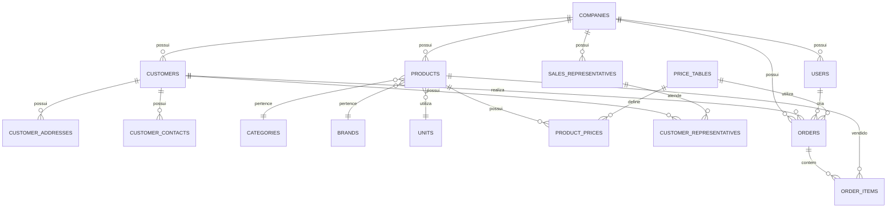
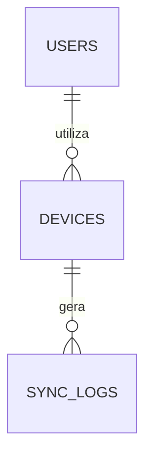
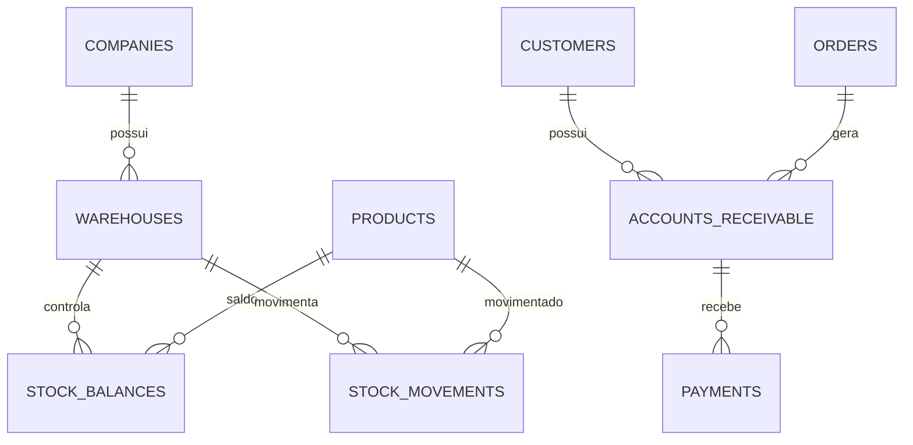

# OrderBox - Diagramas de Relacionamento

## Diagrama Atual

```mermaid
erDiagram

    COMPANIES ||--o{ USERS : possui

    COMPANIES ||--o{ CUSTOMERS : possui

    CUSTOMERS ||--o{ CUSTOMER_ADDRESSES : possui

    CUSTOMERS ||--o{ CUSTOMER_CONTACTS : possui

    COMPANIES ||--o{ PRODUCTS : possui

    PRODUCTS }o--|| CATEGORIES : pertence

    PRODUCTS }o--|| BRANDS : pertence

    PRODUCTS }o--|| UNITS : utiliza

    PRODUCTS ||--o{ PRODUCT_PRICES : possui

    PRICE_TABLES ||--o{ PRODUCT_PRICES : define

    COMPANIES ||--o{ SALES_REPRESENTATIVES : possui

    CUSTOMERS ||--o{ CUSTOMER_REPRESENTATIVES : possui

    SALES_REPRESENTATIVES ||--o{ CUSTOMER_REPRESENTATIVES : atende

    COMPANIES ||--o{ ORDERS : possui

    CUSTOMERS ||--o{ ORDERS : realiza

    USERS ||--o{ ORDERS : cria

    PRICE_TABLES ||--o{ ORDERS : utiliza

    ORDERS ||--o{ ORDER_ITEMS : contem

    PRODUCTS ||--o{ ORDER_ITEMS : vendido
```

---

## Diagrama Mobile

```mermaid
erDiagram

    USERS ||--o{ DEVICES : utiliza

    DEVICES ||--o{ SYNC_LOGS : gera
```

---

## Diagrama Futuro

```mermaid
erDiagram

    COMPANIES ||--o{ WAREHOUSES : possui

    WAREHOUSES ||--o{ STOCK_BALANCES : controla

    PRODUCTS ||--o{ STOCK_BALANCES : saldo

    WAREHOUSES ||--o{ STOCK_MOVEMENTS : movimenta

    PRODUCTS ||--o{ STOCK_MOVEMENTS : movimentado

    CUSTOMERS ||--o{ ACCOUNTS_RECEIVABLE : possui

    ORDERS ||--o{ ACCOUNTS_RECEIVABLE : gera

    ACCOUNTS_RECEIVABLE ||--o{ PAYMENTS : recebe
```