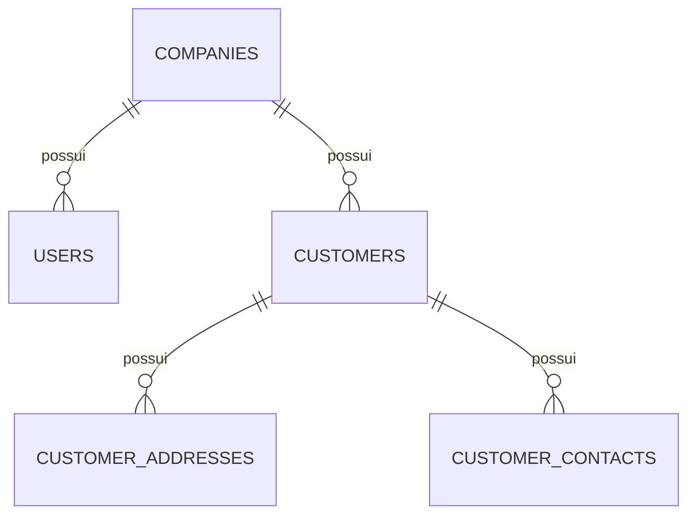
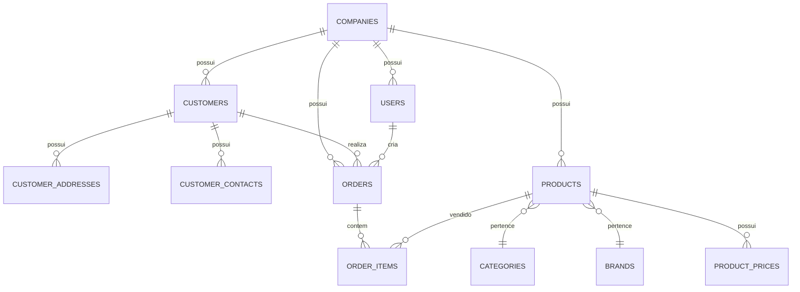
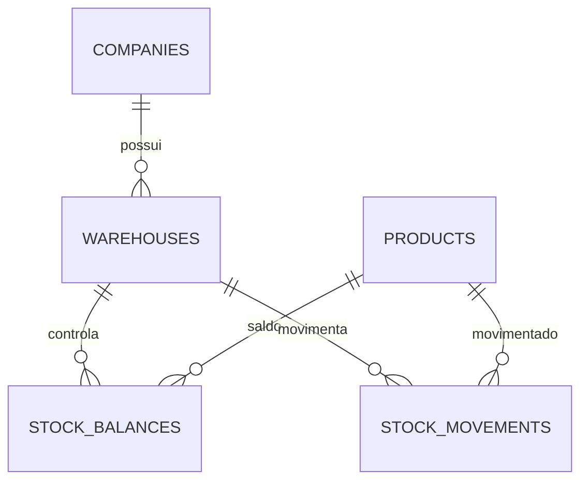
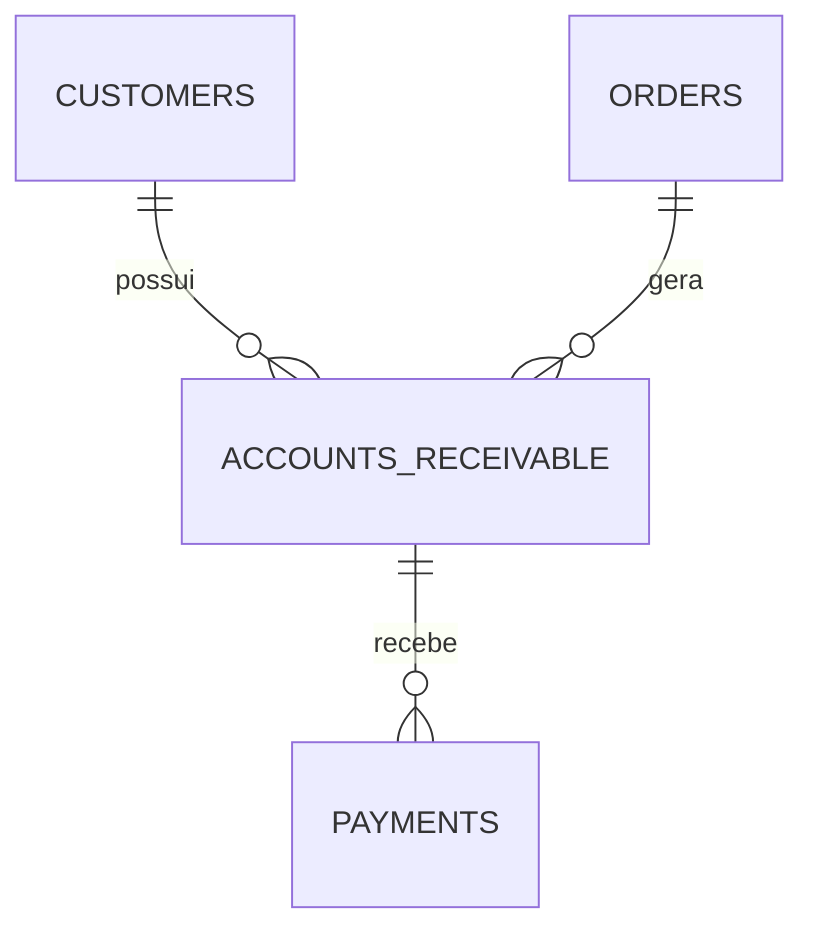
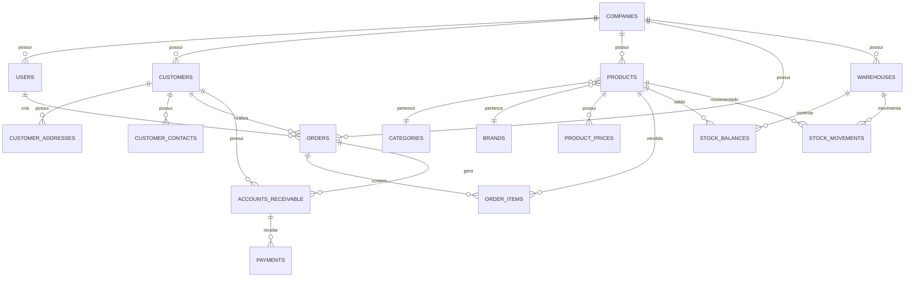

# OrderBox - Diagramas de Relacionamento

## Diagrama Atual

---

## Diagrama Comercial (Planejado)

---

## Diagrama Estoque (Planejado)

---

## Diagrama Financeiro (Planejado)

---

## Diagrama Completo (Visão Futura)

